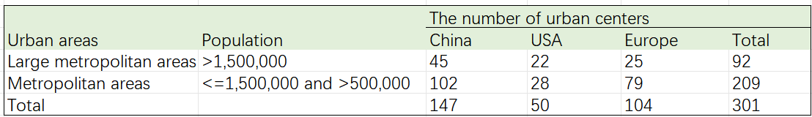
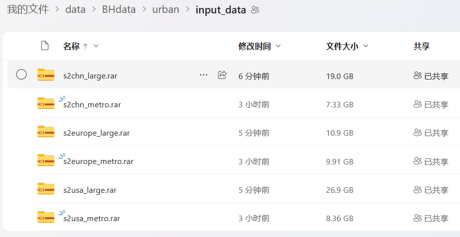

# A deep learning-based super-resolution method for building height estimation at 2.5 m spatial resolution in the Northern Hemisphere
Author: Yinxia Cao, Qihao Weng* | [Paper link](https://www.sciencedirect.com/science/article/pii/S0034425724002591) | Date: August 2024 | Journal: Remote Sensing of Environment 

## Dataset
### 1. pre-processed data
- Download link in [google drive, only with samples](https://drive.google.com/drive/folders/1ngeSyPWOUkj0DTS4M1zuSsbIdYeAHHhS?usp=drive_link) or [Onedrive, full data](https://1drv.ms/f/s!AsLBo0q3zUjCgYRfYHgM8oSZqFsiFg?e=YfJTuf). The total size is 2.72G    
- Unzip them to a path (e.g., `data`)
- Split dataset into train/val/test set, see the directory `data`
 The specific spliting file is put in `BH_dataset.py`
- Obtain the statistics of the dataset, see the directory  `datasteglobe` 
The specifi file is `stats_dataset_globe.py`    
- Distribution of the dataset (45,000 samples)
 
 

### 2. the original data
- original building height data: [onedrive](https://1drv.ms/f/s!AsLBo0q3zUjCgYRfYHgM8oSZqFsiFg?e=YfJTuf)
- original sentinel-1/2 data for sampling construction:   
They were downloaded from GEE for each image patch (640 x 640 m), and therefore there is no orginal data.Just see `1. the pre-processed data`.


## Method


## Setup environments
Necessary libraries were put in file `requirements.txt`


## Training & Testing
```commandline
python train.py
```

## Pretrained weights and test results
See [onedrive](https://1drv.ms/f/s!AsLBo0q3zUjCgYRfYHgM8oSZqFsiFg?e=YfJTuf)
- weights of the super-resolution module: `weights/realesrgan`
- weights of the proposed method for height estimation: `weights/realesrgan_feature_aggre_weight_globe`
- Results on testing set:


## Testing on 301 urban centers
- Basic information   
  For large metropolitan areas, the file name is xx_large, while for metropolitan areas, the file name is xx_metro.

- Data and predicted results: see [onedrive](https://1drv.ms/f/s!AsLBo0q3zUjCgYRfYHgM8oSZqFsiFg?e=YfJTuf)  
The mean and std of each urban center is put in `datasetglobe/urbanarea_meanstd.xls` and the results are put in:

- Predicting by yourself
  - Download and put the origin data (S1&S2) in the current directory `data/urban/input_data`  

  - Prepare xx_grid.shp as the prediction unit
    - Download WSF (world settlement footprint) 2019 at 10-m resolution as the valid built-up areas, see the [official website](https://download.geoservice.dlr.de/WSF2019/)
    - Clip WSF to the extent of each urban center
    - Convert the shapefile of urban centers into rasters
    - Split each urban center into grid with size of 640 x 640 m
    - Select the grid with wsf > 20 pixels

  - Predict all the urban centers
```commandline
python predict_realesanet_feature_globe.py
```
- Results:
    -  Distribution

    - The mean and std of building height in each urban center


## Predict other regions
- Download sentinel-1 & sentinel-2 from the GEE
- Download WSF 


## Other files
- Download sentinel-1 & sentinel-2 from the GEE platform
coming soon